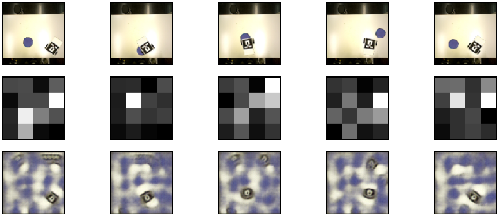

# baxter
> Experimenting with Autoencoding Architectures to Encode World State Representations

This is a small framework for training and testing auto-encoding architectures for the purpose of encoding world state representations into latent space and thus efficiently compressing the essential world properties depicted in the training image dataset.



## Installation

Clone repository to a desired directory:
```
cd C:\dev\
git clone https://github.com/blazm/baxter.git
```

Install Anaconda with Python >= 3.5.

Create virtual environment with the following modules (the code might work with > versions):
> numpy == 1.16.4
> scipy == 1.1.0
> cv2 == 4.1.0
> tensorflow == 1.2.0
> Keras == 2.0.7
> Pillow

## Usage 

File config.ini includes all parameters to train the models.

Setup the parameters, then run training:
```
activate conda_env
(conda_env) python train_ae.py
```
Results will be saved in the snapshots folder (.pdf, .csv, .ini) and in tf-log folder (TensorBoard training log).

## Meta

Blaz Meden – [@blazm](https://github.com/blazm) – blaz.meden@gmail.com

Distributed under the XYZ license. See ``LICENSE`` for more information.

[https://github.com/blazm/baxter](https://github.com/blazm/baxter)

